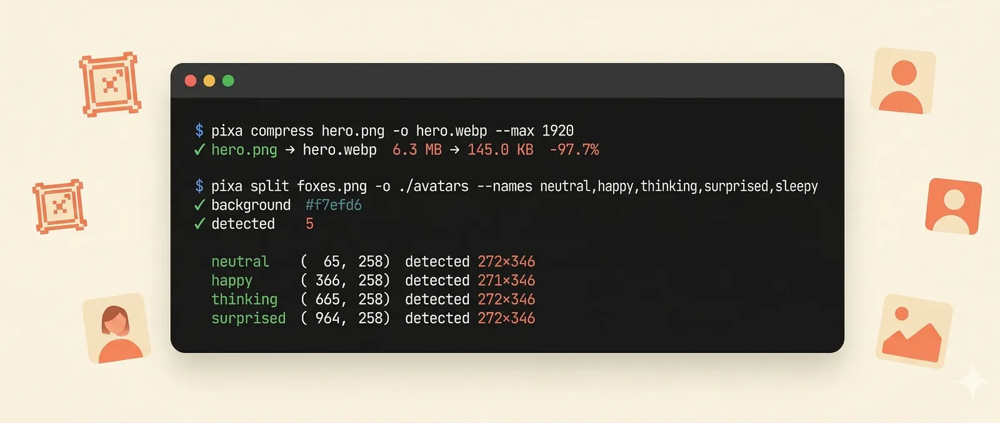
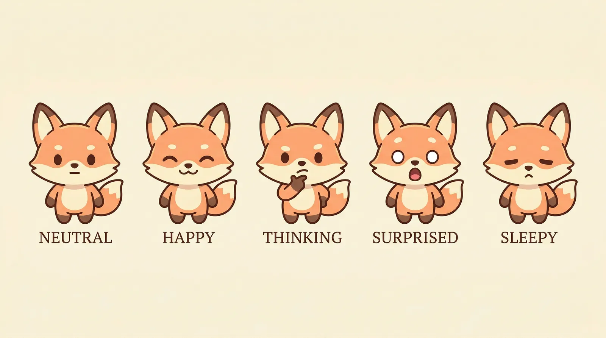
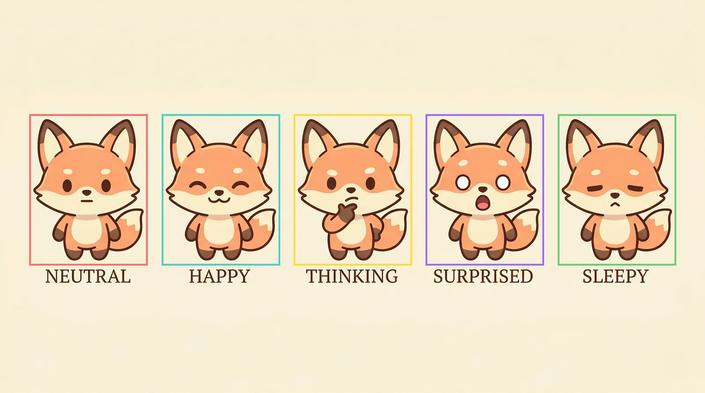

# pixa 🖼️

<p align="center">
  
</p>

<p align="center">
  <a href="https://crates.io/crates/pixa"></a>
  <a href="https://crates.io/crates/pixa"></a>
  <a href="LICENSE"></a>
  <a href="https://github.com/techarm/pixa/actions/workflows/release.yml"></a>
</p>

<p align="center">
  <a href="README.md">English</a> | <a href="README.ja.md">日本語</a>
</p>

Rust 製の高速画像処理 CLI ツールキット。AI 生成画像を Web 配信向けに最適化したり、シート画像を分割したり、Gemini の透かしを除去したりするための実用ツール集。

## 機能

| コマンド             | 説明                                                       |
| -------------------- | ---------------------------------------------------------- |
| `compress`           | MozJPEG / OxiPNG / WebP で圧縮、リサイズ、フォーマット変換 |
| `convert`            | JPEG ↔ PNG ↔ WebP ↔ BMP ↔ GIF ↔ TIFF                       |
| `info`               | 寸法・カラー・EXIF・SHA-256 等を表示                       |
| `favicon`            | 画像から Web 用アイコンセット (ICO + 各サイズ PNG) を生成  |
| `split`              | シート画像から各オブジェクトを自動検出して切り出し         |
| `remove-watermark`   | Gemini AI の透かしを Reverse Alpha Blending で数学的に除去 |
| `detect`             | Gemini 透かしの有無をスコア付きで判定                      |

`compress`, `convert`, `remove-watermark` はファイルとディレクトリの両方を受け付けます。ディレクトリを処理する場合は `-r/--recursive` を付けてください。

> Watermark 削除アルゴリズムは [GeminiWatermarkTool](https://github.com/allenk/GeminiWatermarkTool) by Allen Kuo (MIT License) を参考にしています。

## インストール

### Homebrew (macOS / Linux)

```bash
brew tap techarm/tap
brew install pixa
```

アップデートは `brew upgrade pixa`。

### インストーラスクリプト — Rust ツールチェーン不要

**macOS / Linux:**

```bash
curl --proto '=https' --tlsv1.2 -LsSf \
  https://github.com/techarm/pixa/releases/latest/download/pixa-installer.sh | sh
```

**Windows (PowerShell):**

```powershell
powershell -ExecutionPolicy ByPass -c "irm https://github.com/techarm/pixa/releases/latest/download/pixa-installer.ps1 | iex"
```

インストーラがプラットフォームに合ったバイナリを自動でダウンロードし、
`$PATH` 配下に配置します。対応プラットフォーム: macOS (Intel + Apple
Silicon)、Linux (x86_64 + ARM64)、Windows (x86_64)。

[Releases ページ](https://github.com/techarm/pixa/releases/latest)から
直接ダウンロードすることも可能です。

### crates.io から

```bash
cargo install pixa
```

最新版がソースからビルドされます。Rust ツールチェーンと、`mozjpeg` の
ビルドに必要なシステム依存（下記）が必要です。

### ソースからビルド

前提条件:

- Rust 1.87+
- CMake, NASM, pkg-config (mozjpeg のビルドに必要)

```bash
# Ubuntu / Debian
sudo apt install cmake nasm pkg-config libclang-dev

# macOS
brew install cmake nasm pkg-config

# ビルド
git clone https://github.com/techarm/pixa
cd pixa
cargo build --release
```

バイナリは `target/release/pixa` に出力されます。

## AI コーディングエージェントから使う

Claude Code・GitHub Copilot などのコーディングエージェントから自動で
pixa を呼び出せるようにするには、Skill ファイルをインストールします:

```bash
pixa install --skills
```

これで `~/.claude/skills/pixa/SKILL.md` が配置され、エージェントが
「画像を Web 用に最適化して」「アバターをシートから切り出して」など
のリクエストを受けたときに自動で pixa を使うようになります。

更新時は `pixa install --skills --force` で上書きできます。

## クイックスタート

### AI 画像を Web 用に最適化（一発）

```bash
# 元 PNG → 1920px WebP（リサイズ + 変換 + 圧縮）
pixa compress docs/images/hero.png \
  -o hero.webp --max 1920
# ✓ docs/images/hero.png → hero.webp
#   6.3 MB → 145.0 KB  -97.7%
```

`docs/images/hero.png` はリポジトリに含まれる実際の画像
なので、上記の数字はそのまま再現できます。

### 圧縮

```bash
pixa compress photo.jpg                          # → photo.min.jpg
pixa compress photo.jpg -o smaller.jpg           # 出力名指定
pixa compress ./photos -r                        # → ./photos.min/ にミラー
pixa compress logo.png -o logo.webp              # 拡張子で WebP に変換
pixa compress big.png -o thumb.webp --max 400    # サムネイル
```

`-o` を省略すると元ファイルを上書きせず `.min` サフィックスで保存します。圧縮後にサイズが大きくなる場合は元ファイルを保持します。

### シート画像の自動分割

入力 — 1 枚のスプライトシート:

<p align="center">
  
</p>

1 コマンドで実行:

```bash
pixa split foxes.png -o ./avatars \
  --names neutral,happy,thinking,surprised,sleepy
```

出力 — 5 体のアバター画像。テキストラベルは自動で除外、すべて同じ
サイズにパディングされるので UI コンポーネントにそのまま投入できます:

<p align="center">
  
  
  
  
  
</p>

`--preview` を付けると pixa が実際に検出した範囲を可視化できます。色付き
枠は統一サイズの出力フレームで、その中心に元の bbox が配置されます:

<p align="center">
  
</p>

仕組み:

- 背景色を四隅サンプルから自動検出
- 各オブジェクトの bbox を検出（テキストラベルは自動除外）
- 出力は全て同じサイズに揃えて背景色でパディング（そのまま UI 配置可）
- `--names` で個数を指定すれば、隣接/不均等なキャラも再分割して対応
- `--preview` で検出枠を可視化（`--preview-style detected|output|both`）

### Favicon

```bash
pixa favicon logo.png -o ./public/favicon
# favicon.ico (16/32/48 multi-res) + 16/32/180/192/512 PNG + HTML snippet
```

### 形式変換

```bash
pixa convert photo.png photo.webp                # 単一
pixa convert ./photos ./out -r --format webp     # ディレクトリ再帰
```

### 画像情報

```bash
pixa info photo.jpg
pixa info photo.jpg --json
```

### Watermark 削除・検出

```bash
pixa remove-watermark image.jpg -o clean.jpg
pixa remove-watermark ./photos -r -o ./cleaned --if-detected
pixa detect image.jpg
```

`--if-detected` を付けると、透かしが検出されない画像はスキップします。

## プロジェクト構成

```
pixa/
├── Cargo.toml
├── assets/                       # 埋め込みアルファマップ
│   ├── watermark_48x48.png
│   └── watermark_96x96.png
└── src/
    ├── main.rs                   # CLI エントリポイント
    ├── lib.rs                    # ライブラリ API
    ├── compress.rs               # JPEG / PNG / WebP エンコード + リサイズ
    ├── convert.rs                # フォーマット変換
    ├── favicon.rs                # Favicon セット生成
    ├── info.rs                   # メタデータ抽出
    ├── split.rs                  # シート画像の自動分割
    ├── watermark.rs              # Reverse Alpha Blending
    └── commands/                 # 各サブコマンドの CLI 実装
        ├── mod.rs                # 共通ユーティリティ
        ├── style.rs              # ANSI 色 / シンボル
        ├── compress.rs
        ├── convert.rs
        ├── detect.rs
        ├── favicon.rs
        ├── info.rs
        ├── remove_watermark.rs
        └── split.rs
```

## Watermark 削除のしくみ

Gemini は以下の式で可視透かしを適用します:

```
watermarked = α × logo + (1 - α) × original
```

これを逆算して元のピクセル値を復元します:

```
original = (watermarked - α × logo) / (1 - α)
```

事前にキャリブレーションされた 48×48 / 96×96 のアルファマップを使用するため、AI 推論は不要で高速に動作します。検出は Spatial NCC + Gradient NCC + Variance Analysis の 3 段階で行います。

## ライセンス

MIT
